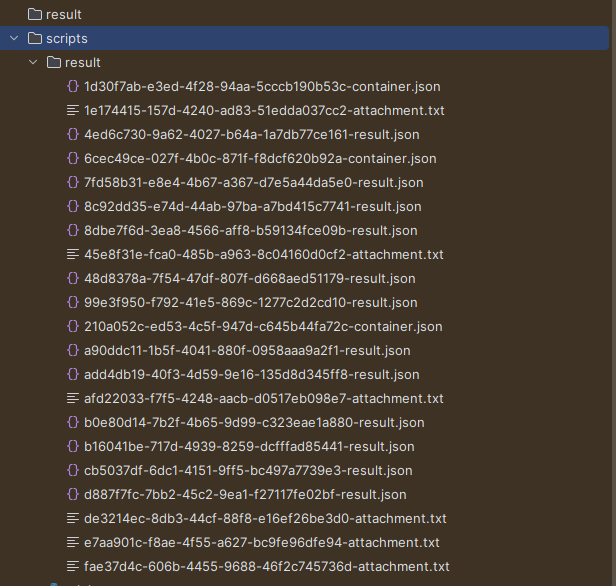
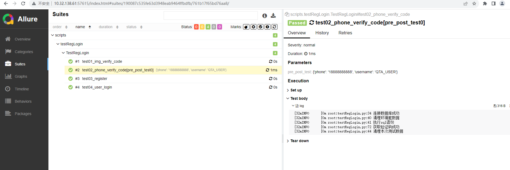

本项目实现接口自动化的技术选型：Python+Requests+Pytest+YAML+Allure ，主要是针对本人的一个接口项目来开展的，通过 Python+Requests 来发送和处理HTTP协议的请求接口，使用 Pytest 作为测试执行器，使用 YAML 来管理测试数据，使用 Allure 来生成测试报告。

项目说明
本项目在实现过程中，把整个项目拆分成请求方法封装、HTTP接口封装、关键字封装、测试用例等模块。

首先利用Python把HTTP接口封装成Python接口，接着把这些Python接口组装成一个个的关键字，再把关键字组装成测试用例，而测试数据则通过YAML文件进行统一管理，然后再通过Pytest测试执行器来运行这些脚本，并结合Allure输出测试报告。

项目部署
首先，下载项目源码后，在根目录下找到 requirements.txt 文件，然后通过 pip 工具安装 requirements.txt 依赖，执行命令：

pip3 install -r requirements.txt
接着，修改 config/setting.ini 配置文件，在Windows环境下，安装相应依赖之后，在命令行窗口执行命令：

项目结构
api ====>> 接口封装层，如封装HTTP接口为Python接口
common ====>> 各种工具类
base ====>> requests请求方法封装、针对不同请求方式做了处理，通过关键字返回结果类，并灵活将接口请求传参和出参写入日志
config ====>> 配置文件
data ====>> 测试数据文件管理，可用yaml或json处理
pytest.ini ====>> pytest配置文件
requirements.txt ====>> 相关依赖包文件
script  ====>> 测试用例
conftest ====>>公共的一些测试方法可存放

在命令行执行命令：pytest 运行用例后，会得到一个测试报告的原始文件，但这个时候还不能打开成HTML的报告，还需要在项目根目录下，执行命令启动 allure 服务：

 需要提前配置allure环境，才可以直接使用命令行
allure serve ./report
最终，可以看到测试报告的效果图如下：

imagepng
关于测试报告：
--alluredir ./report/result
其中./report/result表示将生成的报告存放目录

allure generate 生成测试结果数据 -o 生成报告的路径 --clean
--clean表示：如果已经存在生成报告路径文件夹时，再次使用会提示添加--clean参数来重写
如以下编写用例命令
allure generate report/result/ -o report/html --clean

打开测试报告页面
allure serve .\result\

